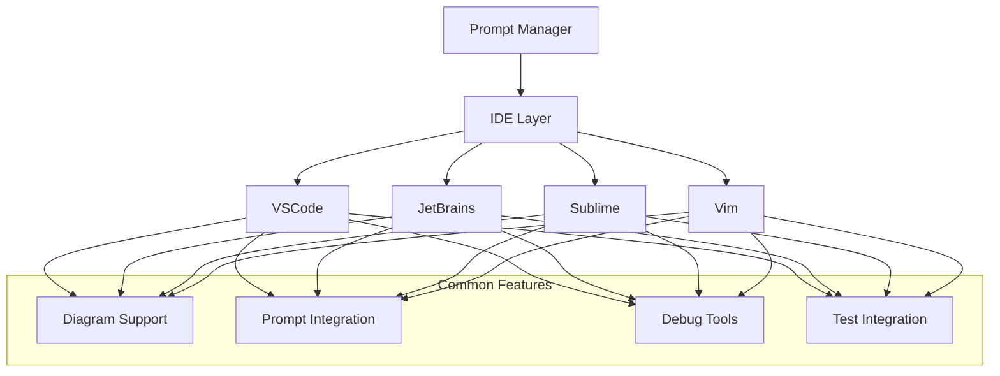

# IDE Integrations

## Overview

This directory contains documentation for integrating the Prompt Manager with various Integrated Development Environments (IDEs). Each integration is designed to leverage the IDE's specific features while maintaining a consistent workflow.

## Supported IDEs

1. [VSCode Integration](vscode/README.md)
   - GitHub Copilot integration
   - Mermaid diagram support
   - Debugging tools
   - Extension integration

2. [JetBrains IDEs](jetbrains/README.md)
   - IntelliJ IDEA
   - PyCharm
   - WebStorm
   - Other JetBrains products

3. [Sublime Text](sublime/README.md)
   - Plugin system
   - Command palette integration
   - Project management

4. [Vim/Neovim](vim/README.md)
   - Plugin integration
   - Command-line workflow
   - Custom keybindings

## Integration Architecture



## Common Features

1. **Diagram Integration**
   - Mermaid diagram rendering
   - Diagram-to-code generation
   - Visual feedback

2. **Prompt Management**
   - Context-aware suggestions
   - Template management
   - History tracking

3. **Debugging Tools**
   - Integrated debugging
   - Error tracking
   - Solution verification

4. **Testing Framework**
   - Pytest integration
   - Test generation
   - Coverage reporting

## Getting Started

1. Choose your IDE from the supported list
2. Follow the specific integration guide
3. Configure your development environment
4. Start using the integrated features

## Contributing

To add support for a new IDE:
1. Create a new directory under `ide-integrations`
2. Follow the template structure
3. Document IDE-specific features
4. Update this README

# IDE Integration Guide

The Prompt Manager system provides robust IDE integration capabilities with transparent prompt inspection for better debugging and learning.

## Command Prompt Inspection

All commands support the `--show-prompt` flag, which displays the prompt template being used. This feature is particularly valuable in IDE integrations for:

1. **Development Workflow**
   - See how commands interpret your input
   - Understand task analysis logic
   - Debug command behavior
   - Train new team members

2. **IDE Features**
   - Command completion with prompt preview
   - Inline prompt display
   - Template validation
   - Context-aware suggestions

## Using --show-prompt in IDEs

### VSCode Integration

```bash
# In VSCode terminal:
prompt-manager base add-task "New Task" "Description" --show-prompt

# Output appears in terminal:
================================================================================
Using prompt template: add-task
================================================================================
Task Analysis Request
...
================================================================================
```

### Command Palette Integration

The `--show-prompt` flag can be added to any command in the VSCode command palette:

1. Open Command Palette (Ctrl/Cmd + Shift + P)
2. Type "Prompt Manager:"
3. Select any command
4. Add `--show-prompt` to see the prompt template

### Keyboard Shortcuts

Configure keyboard shortcuts for common commands with prompt display:

```json
{
  "key": "ctrl+shift+a",
  "command": "workbench.action.terminal.sendSequence",
  "args": {
    "text": "prompt-manager base add-task \"\" \"\" --show-prompt\u001b[2D"
  }
}
```

## Command Groups with Prompt Display

### Base Commands
```bash
# Task Management
prompt-manager base add-task "Task" "Description" --show-prompt
prompt-manager base update-progress "Task" "in_progress" --show-prompt
prompt-manager base list-tasks --show-prompt
```

### Debug Commands
```bash
# Debugging
prompt-manager debug analyze-file file.py --show-prompt
prompt-manager debug find-root-cause error.log --show-prompt
```

### LLM Commands
```bash
# LLM Enhancement
prompt-manager llm analyze-impact file.py --show-prompt
prompt-manager llm suggest-improvements file.py --show-prompt
```

### Memory Commands
```bash
# Memory Operations
prompt-manager memory store key value --show-prompt
prompt-manager memory retrieve key --show-prompt
```

## Prompt Template Structure

When using `--show-prompt`, you'll see the following structure:

```
================================================================================
Using prompt template: [command-name]
================================================================================
[Template Title]
[Template Description]

[Context Variables]
- Variable 1: Value
- Variable 2: Value
...

[Analysis Sections]
1. Section One
   - Point A
   - Point B

2. Section Two
   - Point C
   - Point D
================================================================================
```

## Best Practices

1. **Development**
   - Use `--show-prompt` during development to understand command behavior
   - Validate prompt templates match expected output
   - Debug command issues by inspecting prompts

2. **Training**
   - Show new team members how commands work with `--show-prompt`
   - Use prompt display for documentation
   - Create example commands with prompt display

3. **Debugging**
   - Inspect prompts when commands behave unexpectedly
   - Verify context variables are correct
   - Check template formatting

4. **Documentation**
   - Include `--show-prompt` examples in documentation
   - Document prompt template structure
   - Explain context variables

## Integration Examples

### Task Creation with Prompt Display
```bash
# Create task and show prompt
prompt-manager base add-task "Feature X" "Add new feature" --show-prompt

# Analyze output
================================================================================
Using prompt template: add-task
================================================================================
Task Analysis Request
...
================================================================================
```

### Error Analysis with Prompt Display
```bash
# Debug error with prompt
prompt-manager debug analyze-file buggy.py --show-prompt

# Review analysis prompt
================================================================================
Using prompt template: analyze-file
================================================================================
Code Analysis Request
...
================================================================================
```

### Memory Operations with Prompt Display
```bash
# Store data with prompt
prompt-manager memory store "key" "value" --show-prompt

# View memory operation prompt
================================================================================
Using prompt template: store-memory
================================================================================
Memory Store Request
...
================================================================================
```

## Customization

### Custom Prompt Templates

Create custom prompt templates in your project:

```yaml
# templates/custom/my-command.yaml
name: my-command
description: Custom command template
required_context:
  - input_data
  - project_context
template: |
  Custom Command Request
  =====================
  
  Input: {input_data}
  Context: {project_context}
  ...
```

### IDE-Specific Integration

Configure IDE-specific settings for prompt display:

```json
{
  "promptManager.showPrompts": true,
  "promptManager.promptDisplay": {
    "location": "terminal",  // or "output", "webview"
    "format": "detailed",    // or "minimal"
    "highlight": true
  }
}
```

## Troubleshooting

1. **Prompt Not Displaying**
   - Verify `--show-prompt` flag is added
   - Check terminal output configuration
   - Ensure template file exists

2. **Invalid Template Format**
   - Validate YAML syntax
   - Check required fields
   - Verify template structure

3. **Context Variables Missing**
   - Review required context
   - Check variable names
   - Verify data sources

4. **IDE Integration Issues**
   - Update IDE extensions
   - Check configuration
   - Verify permissions
