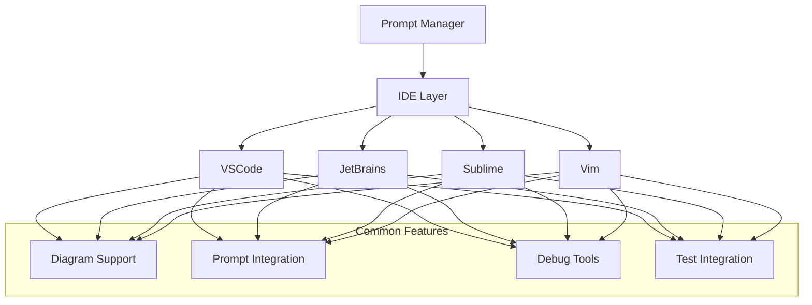

# IDE Integrations

## Overview

This directory contains documentation for integrating the Prompt Manager with various Integrated Development Environments (IDEs). Each integration is designed to leverage the IDE's specific features while maintaining a consistent workflow.

## Supported IDEs

1. [VSCode Integration](vscode/README.md)
   - GitHub Copilot integration
   - Mermaid diagram support
   - Debugging tools
   - Extension integration

2. [JetBrains IDEs](jetbrains/README.md)
   - IntelliJ IDEA
   - PyCharm
   - WebStorm
   - Other JetBrains products

3. [Sublime Text](sublime/README.md)
   - Plugin system
   - Command palette integration
   - Project management

4. [Vim/Neovim](vim/README.md)
   - Plugin integration
   - Command-line workflow
   - Custom keybindings

## Integration Architecture

## Common Features

1. **Diagram Integration**
   - Mermaid diagram rendering
   - Diagram-to-code generation
   - Visual feedback

2. **Prompt Management**
   - Context-aware suggestions
   - Template management
   - History tracking

3. **Debugging Tools**
   - Integrated debugging
   - Error tracking
   - Solution verification

4. **Testing Framework**
   - Pytest integration
   - Test generation
   - Coverage reporting

## Getting Started

1. Choose your IDE from the supported list
2. Follow the specific integration guide
3. Configure your development environment
4. Start using the integrated features

## Contributing

To add support for a new IDE:
1. Create a new directory under `ide-integrations`
2. Follow the template structure
3. Document IDE-specific features
4. Update this README
