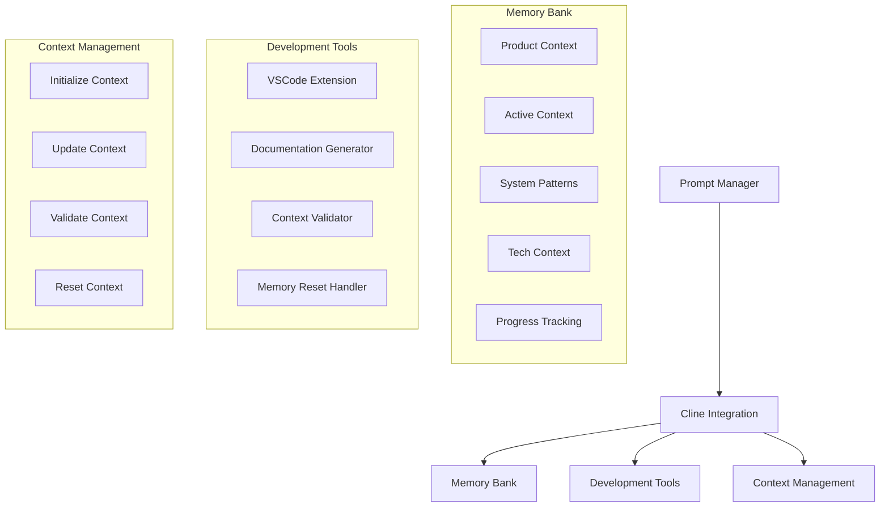

# Cline Integration

## Overview

This guide details how to integrate the Prompt Manager with Cline, a self-documenting development system that maintains context across sessions through a structured "Memory Bank".

## System Architecture



## Integration Points

### 1. Memory Bank Structure

```python
class MemoryBankManager:
    def __init__(self, project_root):
        self.docs_path = f"{project_root}/cline_docs"
        self.required_files = [
            "productContext.md",
            "activeContext.md",
            "systemPatterns.md",
            "techContext.md",
            "progress.md"
        ]
    
    def initialize_memory_bank(self):
        """Create memory bank structure"""
        if not os.path.exists(self.docs_path):
            os.makedirs(self.docs_path)
            
        for file in self.required_files:
            file_path = f"{self.docs_path}/{file}"
            if not os.path.exists(file_path):
                self.create_context_file(file)
    
    def create_context_file(self, filename):
        """Create individual context file"""
        templates = {
            "productContext.md": {
                "sections": [
                    "Project Purpose",
                    "Problem Statement",
                    "Functionality Overview"
                ]
            },
            "activeContext.md": {
                "sections": [
                    "Current Tasks",
                    "Recent Changes",
                    "Next Steps"
                ]
            }
            # ... templates for other files
        }
```

### 2. Context Management

```python
class ContextManager:
    def __init__(self, memory_bank):
        self.memory_bank = memory_bank
        self.active = False
    
    def validate_context(self):
        """Ensure all required context is present"""
        missing_files = []
        for file in self.memory_bank.required_files:
            if not os.path.exists(
                f"{self.memory_bank.docs_path}/{file}"
            ):
                missing_files.append(file)
        
        if missing_files:
            raise ContextError(
                f"Missing required files: {missing_files}"
            )
    
    def update_context(self, changes):
        """Update context files with new information"""
        for file, content in changes.items():
            file_path = f"{self.memory_bank.docs_path}/{file}"
            with open(file_path, "a") as f:
                f.write(f"\n\n## Update: {datetime.now()}\n")
                f.write(content)
```

### 3. Development Integration

```python
class ClineIntegration:
    def __init__(self, prompt_manager):
        self.pm = prompt_manager
        self.memory_bank = MemoryBankManager(
            self.pm.project_root
        )
        self.context = ContextManager(self.memory_bank)
    
    def start_development(self):
        """Initialize development session"""
        self.context.validate_context()
        self.context.active = True
        return "[MEMORY BANK: ACTIVE]"
    
    def handle_memory_reset(self):
        """Handle imminent memory reset"""
        if self.context.active:
            self.context.update_context({
                "activeContext.md": self.get_current_state(),
                "progress.md": self.get_progress_update()
            })
```

## Feature Integration

### 1. Project Initialization

```python
def initialize_project(project_brief):
    """Initialize new project with memory bank"""
    memory_bank = MemoryBankManager(project_root)
    memory_bank.initialize_memory_bank()
    
    context = ContextManager(memory_bank)
    context.update_context({
        "productContext.md": extract_product_context(
            project_brief
        ),
        "techContext.md": determine_tech_stack(
            project_brief
        )
    })
```

### 2. Development Workflow

```python
def development_workflow():
    """Standard development workflow"""
    # 1. Start session
    integration = ClineIntegration(prompt_manager)
    integration.start_development()
    
    # 2. During development
    while development_active:
        # Monitor token usage
        if tokens_used > 2_000_000:
            integration.handle_memory_reset()
            break
            
        # Update context after significant changes
        if significant_change_detected():
            integration.context.update_context(
                get_change_context()
            )
```

### 3. Memory Reset Handling

```python
def handle_reset():
    """Handle memory reset request"""
    # 1. Document current state
    current_state = get_current_state()
    
    # 2. Update memory bank
    context.update_context({
        "activeContext.md": current_state,
        "progress.md": get_progress_update()
    })
    
    # 3. Clear session
    context.active = False
```

## Workflow Examples

### 1. New Project Setup

```python
# Initialize new project
project_brief = """
Build a modern e-commerce platform with:
- React frontend
- Python backend
- PostgreSQL database
"""

initialize_project(project_brief)
```

### 2. Development Session

```python
# Start development session
integration = ClineIntegration(prompt_manager)
integration.start_development()

# During development
while development_active:
    print("[MEMORY BANK: ACTIVE]")
    # Development tasks...
    
    if tokens_approaching_limit():
        integration.handle_memory_reset()
        break
```

## Best Practices

1. **Memory Bank Management**
   - Always initialize memory bank first
   - Validate context before starting
   - Update after significant changes
   - Handle resets gracefully

2. **Development Process**
   - Monitor token usage
   - Document changes consistently
   - Validate context regularly
   - Plan for memory resets

3. **Context Maintenance**
   - Keep documentation current
   - Validate all changes
   - Maintain clear next steps
   - Document technical decisions

## Tips and Tricks

1. **Efficient Development**
   - Use templates for context files
   - Automate context updates
   - Monitor token usage
   - Plan work around resets

2. **Context Management**
   - Regular validation checks
   - Automated documentation
   - Clear change tracking
   - Structured updates

3. **Memory Reset Handling**
   - Plan for regular resets
   - Document thoroughly
   - Clear next steps
   - Validate context

## Troubleshooting

1. **Missing Context**
   - Check file existence
   - Validate content
   - Recreate if necessary
   - Update documentation

2. **Integration Issues**
   - Verify memory bank
   - Check token usage
   - Validate changes
   - Update context

## Resources

1. **Documentation**
   - Memory Bank structure
   - Context management
   - Development workflow
   - Reset handling

2. **Examples**
   - Project templates
   - Context examples
   - Workflow patterns
   - Reset procedures
