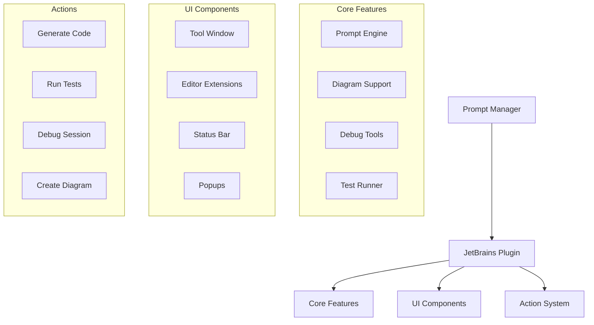
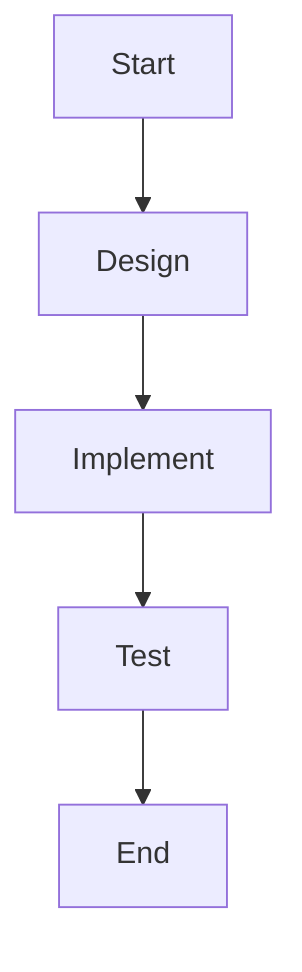

# JetBrains IDEs Integration

## Overview

This guide details how to integrate the Prompt Manager with JetBrains IDEs (IntelliJ IDEA, PyCharm, WebStorm, etc.).

## System Architecture



## Integration Points

### 1. Plugin Configuration

```xml
<!-- plugin.xml -->
<idea-plugin>
    <id>com.promptmanager.jetbrains</id>
    <name>Prompt Manager</name>
    <vendor>Prompt Manager Team</vendor>
    
    <depends>com.intellij.modules.platform</depends>
    <depends>com.intellij.modules.python</depends>
    
    <extensions defaultExtensionNs="com.intellij">
        <toolWindow id="Prompt Manager"
                   icon="/icons/pm.png"
                   anchor="right"
                   factoryClass="com.promptmanager.window.PromptManagerWindowFactory"/>
    </extensions>
</idea-plugin>
```

### 2. Action Registration

```kotlin
class PromptManagerActions {
    fun registerActions() {
        // Register actions
        val actionManager = ActionManager.getInstance()
        
        // Generate Code action
        actionManager.registerAction(
            "PromptManager.GenerateCode",
            GenerateCodeAction()
        )
        
        // Create Diagram action
        actionManager.registerAction(
            "PromptManager.CreateDiagram",
            CreateDiagramAction()
        )
    }
}
```

### 3. Tool Window Integration

```kotlin
class PromptManagerWindow : ToolWindowFactory {
    override fun createToolWindowContent(
        project: Project,
        toolWindow: ToolWindow
    ) {
        // Create tool window content
        val content = ContentFactory.getInstance()
            .createContent(
                PromptManagerPanel(project),
                "Prompt Manager",
                false
            )
        
        toolWindow.contentManager.addContent(content)
    }
}
```

## Feature Integration

### 1. Prompt Management

```kotlin
class PromptIntegration(private val project: Project) {
    fun handlePrompt(context: PromptContext) {
        // Get current editor
        val editor = FileEditorManager.getInstance(project)
            .selectedTextEditor
        
        // Get selection
        val selection = editor?.selectionModel?.selectedText
        
        // Generate prompt
        val prompt = promptManager.generatePrompt(
            context = context,
            file = editor?.document?.virtualFile,
            selection = selection
        )
    }
}
```

### 2. Diagram Support

```kotlin
class DiagramSupport {
    fun renderDiagram(diagramText: String) {
        // Create diagram panel
        val panel = DiagramPanel()
        
        // Render Mermaid diagram
        panel.renderMermaid(diagramText)
        
        // Show in tool window
        ToolWindowManager.getInstance(project)
            .getToolWindow("Diagram")
            ?.contentManager
            ?.addContent(
                ContentFactory.getInstance()
                    .createContent(panel, "Diagram", false)
            )
    }
}
```

### 3. Debug Integration

```kotlin
class DebugIntegration {
    fun startDebugSession() {
        // Start debug session
        val debugSession = promptManager.debugManager
            .startDebugSession()
        
        // Configure debug runner
        val runnerAndConfigurationSettings =
            RunManager.getInstance(project)
                .createConfiguration(
                    "Debug Session",
                    PythonConfigurationType::class.java
                )
        
        // Start debugging
        ProgramRunnerUtil.executeConfiguration(
            runnerAndConfigurationSettings,
            DefaultDebugExecutor.getDebugExecutorInstance()
        )
    }
}
```

### 4. Test Integration

```kotlin
class TestIntegration {
    fun runTests() {
        // Configure test runner
        val configuration = PyTestConfiguration(project)
        
        // Set up test runner
        configuration.apply {
            workingDirectory = project.basePath
            scriptName = "pytest"
            useCustomScript = true
        }
        
        // Run tests
        ProgramRunnerUtil.executeConfiguration(
            RunManager.getInstance(project)
                .createConfiguration(
                    "PyTest",
                    PyTestConfigurationType::class.java
                ),
            DefaultRunExecutor.getRunExecutorInstance()
        )
    }
}
```

## Workflow Examples

### 1. Feature Development

```kotlin
// Start feature development
promptManager.createTask("new_feature", """

""")

// JetBrains IDE will:
1. Render diagram in tool window
2. Create task structure
3. Set up test configurations
4. Configure debug session
```

### 2. Debugging Workflow

```kotlin
// Start debugging
val debugSession = promptManager.debugManager
    .startDebugSession()

// JetBrains IDE will:
1. Open debug tool window
2. Load debug configuration
3. Set breakpoints
4. Start debug session
```

## Best Practices

1. **Project Organization**
   - Use project structure dialog
   - Configure module dependencies
   - Set up run configurations

2. **Keyboard Shortcuts**
   - Create custom keymap
   - Use action search
   - Configure quick lists

3. **Tool Integration**
   - Configure version control
   - Set up test runners
   - Enable diagram preview

## Tips and Tricks

1. **Efficient Development**
   - Use split editors
   - Leverage intentions
   - Use live templates

2. **Debugging**
   - Use breakpoint types
   - Configure watches
   - Enable frame evaluation

3. **Testing**
   - Run tests with coverage
   - Use test runner
   - Configure test filters

## Troubleshooting

1. **Plugin Issues**
   - Check event log
   - Verify plugin settings
   - Update IDE and plugins

2. **Integration Problems**
   - Check project structure
   - Verify SDK settings
   - Update dependencies

## Resources

1. **Documentation**
   - JetBrains Platform SDK
   - Plugin development guide
   - IDE features

2. **Examples**
   - Sample plugins
   - Integration patterns
   - Workflow examples
