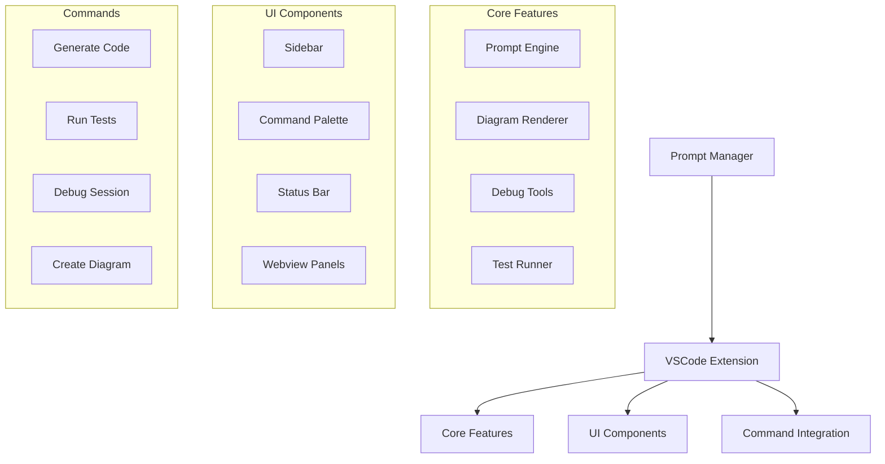
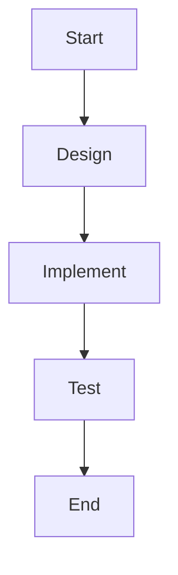

# VSCode Integration

## Overview

This guide details how to integrate the Prompt Manager with Visual Studio Code, leveraging VSCode's extensive feature set and extension ecosystem.

## System Architecture



## Integration Points

### 1. Extension Configuration

```json
{
    "promptManager.vscode": {
        "diagramSupport": true,
        "copilotIntegration": true,
        "debugTools": true,
        "testRunner": true
    }
}
```

### 2. Command Registration

```python
class VSCodeIntegration:
    def __init__(self, prompt_manager):
        self.pm = prompt_manager
        self.register_commands()
    
    def register_commands(self):
        """Register VSCode commands"""
        commands = {
            'promptManager.generateCode': self.generate_code,
            'promptManager.createDiagram': self.create_diagram,
            'promptManager.runTests': self.run_tests,
            'promptManager.debug': self.start_debug
        }
```

### 3. UI Components

```python
class PromptManagerUI:
    def create_sidebar(self):
        """Create sidebar view"""
        return {
            'id': 'promptManager',
            'title': 'Prompt Manager',
            'content': self.get_sidebar_content()
        }
    
    def create_webview(self):
        """Create webview panel"""
        return {
            'type': 'webview',
            'content': self.get_webview_content()
        }
```

## Feature Integration

### 1. Prompt Management

```python
class PromptIntegration:
    def handle_prompt(self, context):
        """Process prompt in VSCode context"""
        # Get current file
        current_file = vscode.window.activeTextEditor.document
        
        # Get selection
        selection = vscode.window.activeTextEditor.selection
        
        # Generate prompt
        prompt = self.pm.generate_prompt(
            context=context,
            file=current_file,
            selection=selection
        )
```

### 2. Diagram Support

```python
class DiagramIntegration:
    def render_diagram(self, diagram_text):
        """Render Mermaid diagram in VSCode"""
        webview = self.create_webview()
        webview.update_content({
            'type': 'mermaid',
            'content': diagram_text
        })
    
    def create_diagram(self):
        """Create new diagram"""
        diagram = self.pm.create_diagram()
        self.render_diagram(diagram)
```

### 3. Debug Integration

```python
class DebugIntegration:
    def start_debug_session(self):
        """Start debug session in VSCode"""
        debug_session = self.pm.debug_manager.start_debug_session()
        
        vscode.debug.start_debugging({
            'type': 'python',
            'request': 'launch',
            'program': '${file}',
            'context': debug_session
        })
```

### 4. Test Integration

```python
class TestIntegration:
    def run_tests(self):
        """Run tests in VSCode"""
        test_config = {
            'pytest': True,
            'coverage': True,
            'output': 'test-explorer'
        }
        
        self.pm.run_tests(test_config)
```

## Workflow Examples

### 1. Feature Development

```python
# Start feature development
pm.create_task("new_feature", """

""")

# VSCode will:
1. Render diagram in webview
2. Create task structure
3. Set up test files
4. Configure debug session
```

### 2. Debugging Workflow

```python
# Start debugging
debug_session = pm.debug_manager.start_debug_session()

# VSCode will:
1. Open debug perspective
2. Load debug configuration
3. Set breakpoints
4. Start debug session
```

## Best Practices

1. **Workspace Organization**
   - Use workspace settings
   - Configure file associations
   - Set up task automation

2. **Keybindings**
   - Create custom shortcuts
   - Map common commands
   - Use chord keybindings

3. **Extension Integration**
   - Configure Copilot
   - Set up test explorer
   - Enable diagram preview

## Tips and Tricks

1. **Efficient Development**
   - Use split editors
   - Leverage quick fixes
   - Use task automation

2. **Debugging**
   - Set conditional breakpoints
   - Use watch expressions
   - Enable hot reload

3. **Testing**
   - Run tests in watch mode
   - Use test explorer
   - Enable coverage highlighting

## Troubleshooting

1. **Extension Issues**
   - Check extension logs
   - Verify configuration
   - Update extensions

2. **Integration Problems**
   - Check workspace settings
   - Verify file paths
   - Update dependencies

## Resources

1. **Documentation**
   - VSCode API docs
   - Extension guides
   - Debug protocol

2. **Examples**
   - Sample configurations
   - Workflow examples
   - Integration patterns
